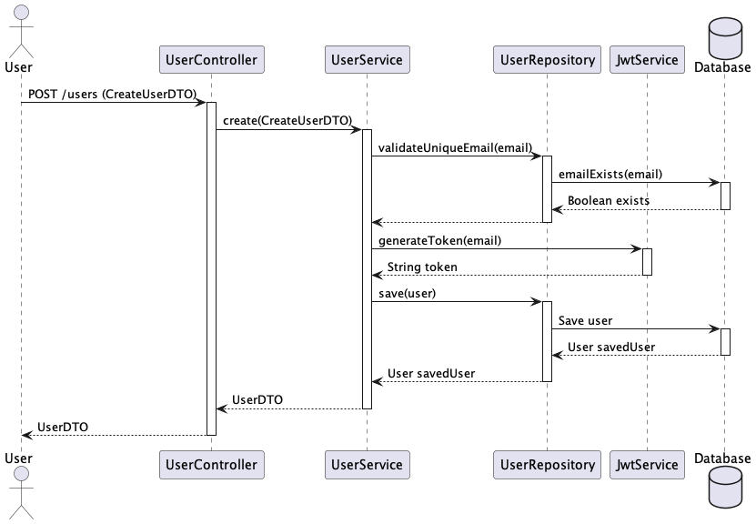

# User Service
Servicio API RESTful de creación de usuarios.

## Tech Stack
- Java 17
- Spring Boot 3.1.4 
- Base de Datos H2

## Diagrama de secuencia


## Base de Datos
- Inicializada automáticamente via Flyway.
- Credenciales:
  - url: jdbc:h2:mem:userdb
  - user: admin
  - password: admin
- API h2
  - http://localhost:8080/h2-console
  - ```select * from users;```

## Ejecutar la aplicación
```
./gradlew bootRun
```

## Ejecutar pruebas
```
./gradlew test
```

## Swagger
- http://localhost:8080/swagger-ui/index.html